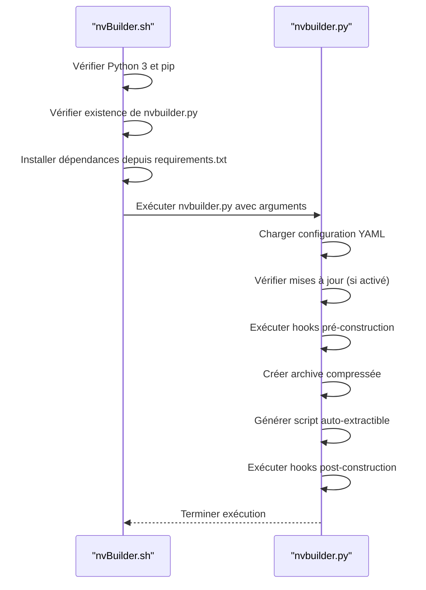

# Analyse de l'intégration entre nvBuilder.sh et nvbuilder.py

## Introduction

Ce document analyse l'intégration entre les scripts `nvBuilder.sh` et `nvbuilder.py`. Le script Bash `nvBuilder.sh` sert de point d'entrée pour exécuter le script Python `nvbuilder.py`, qui effectue la génération d'un script auto-extractible contenant une archive compressée des fichiers de contenu.

## Plan d'analyse

1. **Vérifications initiales dans `nvBuilder.sh`:**
   - Vérification de l'installation de Python 3 et pip.
   - Vérification de l'existence du script Python `nvbuilder.py`.
   - Installation des dépendances via `requirements.txt`.

2. **Exécution de `nvbuilder.py`:**
   - Initialisation de la classe `NvBuilder` avec la configuration YAML.
   - Vérification des mises à jour si activée.
   - Création d'une archive compressée du répertoire de contenu.
   - Génération d'un script auto-extractible contenant l'archive.
   - Exécution des hooks pré et post construction.

## Diagramme de séquence

## Conclusion

Ce plan d'analyse fournit une vue détaillée de l'intégration entre les scripts `nvBuilder.sh` et `nvbuilder.py`. Il peut être utilisé comme référence pour comprendre comment ces deux scripts interagissent lors de la génération d'un script auto-extractible.